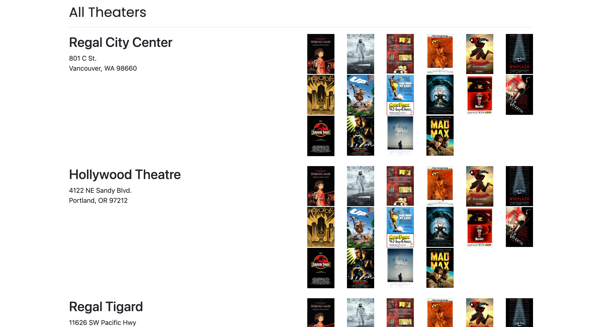

# WeLoveMovies Server

This is the backend server for the WeLoveMovies frontend [repo](https://github.com/Blizzcane/starter-movie-front-end). Created using Node.js, Knex.js, and Express.js.

 ## Links
 - [Deployment](https://starter-movie-front-end-sandy.vercel.app/) 

 ## Home
 

 ## All Movies
  

 ## Movie Details
  

 ## Theaters
 

 ## Features
 - Built an API using RESTful design principles
 - Access to relevant information through route and query parameters
 - Error handlers for the case where a route doesn't exist
 - Utilized Knex to write database queries
 - Completed CRUD routes in an Express server
 
 
 ## Technology
 ### Built with:
 - Node.js
 - Knex.js 
 - Express.js
 - PostgreSQL(ElephantSQL)
 - CORS

